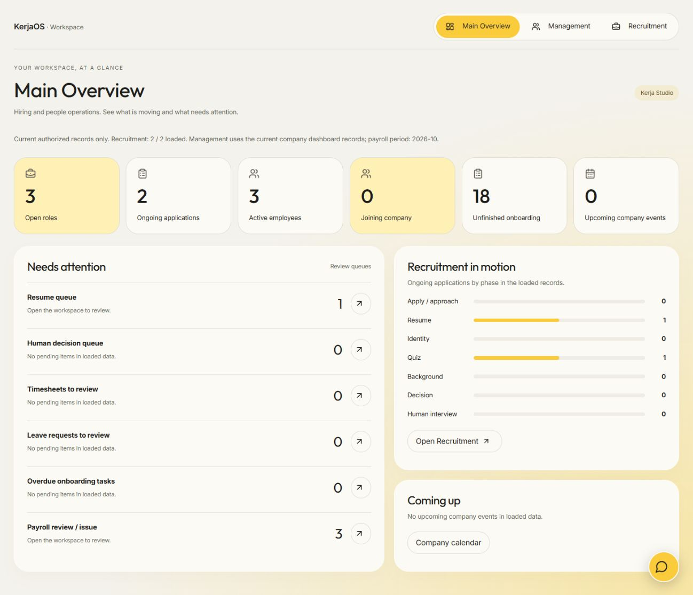
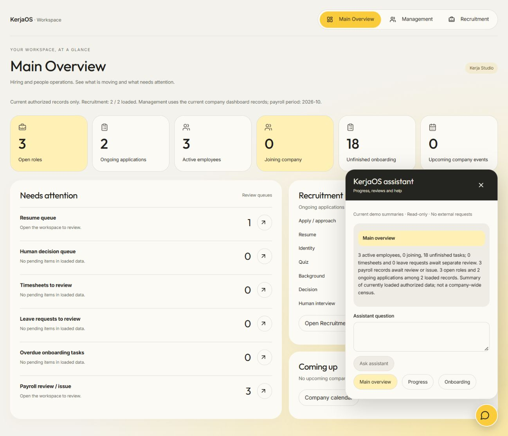
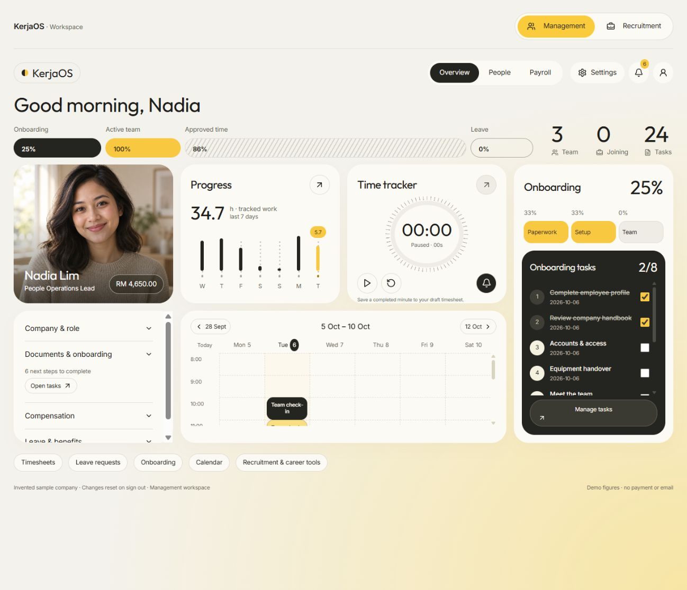
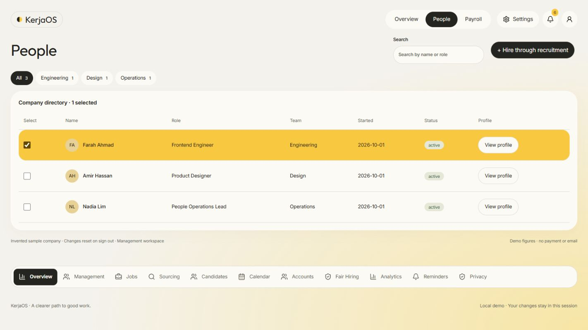
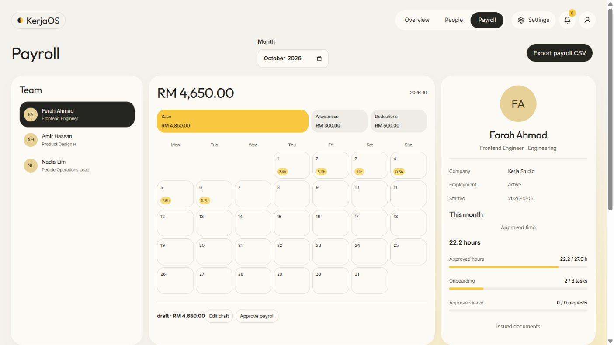
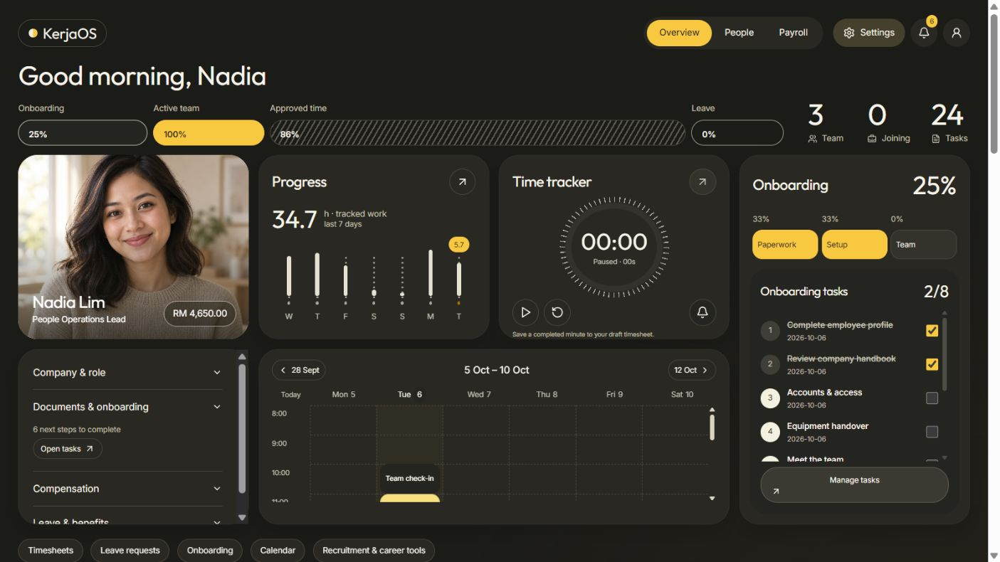
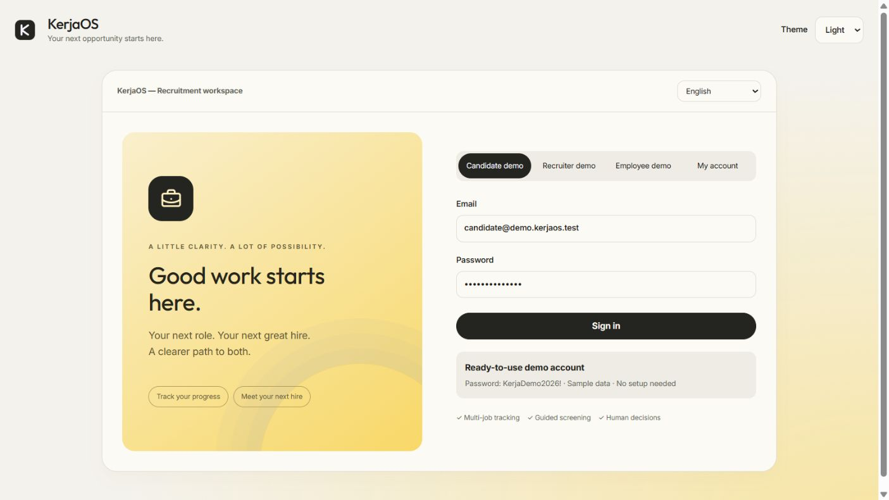
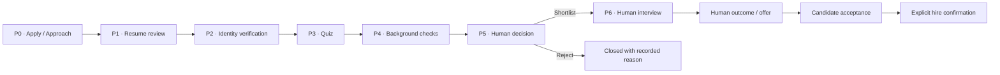
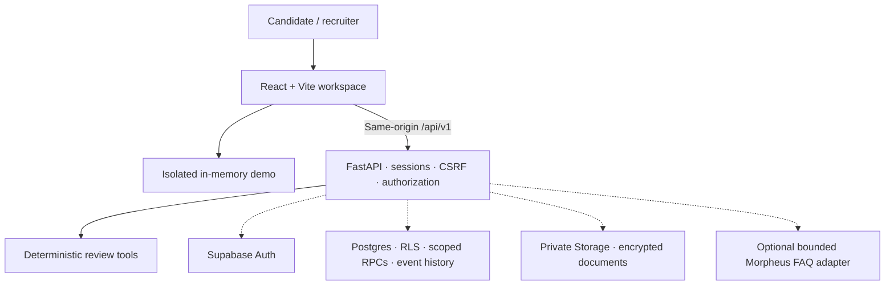

<div align="center">


# KerjaOS

**From your next application to your first day — and every workday after.**

Recruitment and company HR in one workspace: applications, human hiring decisions, onboarding, timesheets, leave and payroll records.


[Features](#features) · [Screenshots](#screenshots) · [Try the demo](#demo-accounts) · [Local setup](#local-setup) · [Roadmap](#roadmap) · [Documentation](#documentation)

</div>

> **One overview, two workspaces:** Use **Main Overview** for combined activity, review queues, recruitment phases and upcoming company events. Use **Management** for people, payroll and employee operations, or **Recruitment** for hiring and career tools. Switching preserves your selected page and unsaved drafts during the session. Recruiter demos start on Main Overview; employee demos start in Management. A floating assistant opens a chatbox across all signed-in modes. It uses current demo summaries or the existing scoped progress API and authorized workspace summaries.

## Overview

KerjaOS brings applications, assessments, interview scheduling and personal job tracking into one workspace. Candidates can apply to multiple jobs and see a separate history and next step for each application. Recruiters can review role fit and career trajectory, inspect the evidence behind recommendations and manage a guarded hiring pipeline.

The interface follows the selected cream/yellow reel: black pill navigation, rounded bento cards, thin bar graphs, a circular timer, dark onboarding panel, people directory and weekly/monthly calendars. Light/dark and responsive layouts are retained. English and Bahasa Melayu support is present; a complete copy review remains open.

**Current status — 6 October 2026:** M1–M12, U1–U5/H1, U6 and U7 local gates have passed. Ready candidate, recruiter/management and employee demos use invented data. The HR migration and API are built locally; statutory payroll and hosted HR activation remain open. Full development Supabase integration remains in L1; the last recorded service check found the application schema and private bucket still missing. Frontend and backend stay local. Vercel/Railway deployment is D1, the final phase.

## Contents

- [Why KerjaOS](#why-kerjaos)
- [Features](#features)
- [Screenshots](#screenshots)
- [Demo accounts](#demo-accounts)
- [Hiring workflow](#hiring-workflow)
- [Review tools and scoring](#review-tools-and-scoring)
- [Architecture](#architecture)
- [Tech stack](#tech-stack)
- [Local setup](#local-setup)
- [Configuration](#configuration)
- [API map](#api-map)
- [Privacy and security](#privacy-and-security)
- [Validation](#validation)
- [Roadmap](#roadmap)
- [Troubleshooting](#troubleshooting)
- [Project layout](#project-layout)
- [Documentation](#documentation)
- [Acknowledgements](#acknowledgements)

## Why KerjaOS

| Recruitment problem | KerjaOS approach | Where to see it |
| --- | --- | --- |
| Applications disappear into separate inboxes. | Each job application has its own stages, event history and next action. | Candidate Applications |
| A score gives little explanation. | Role-fit and trajectory views expose contributors, questions and review reports. | Recruiter Overview and candidate details |
| Institution prestige can obscure relevant skills. | Active merit scoring excludes institution rank; visibility controls and paired samples support a separate audit comparison. | Fair Hiring Controls |
| Practice feels disconnected from the real process. | Private mock quizzes give readiness feedback alongside published hiring assessments. | Candidate Quiz and Interview Results |
| Job hunting involves scattered notes and files. | Private company tracking, external applications, resume versions and reminders share one workspace. | Tracker, Analytics and Reminders |
| Sensitive checks need context and oversight. | Separate consent, manual evidence review, disputes and explicit human transitions. | Identity, Background and Privacy |

## Features

The tables describe implemented local functionality. Real-account operation depends on the remaining L1 integration and H1 grant-provisioning gates; sample data demonstrates the interface without creating production records.

### Candidate workspace

| Feature | What candidates can do |
| --- | --- |
| Multiple applications | Apply to different jobs and inspect each application's progress, history and next action independently. |
| Profile and resumes | Edit profile details, preview readable PDFs and manage private, versioned resume files. |
| Assessments and practice | Complete published quizzes, view results and take private mock tests for readiness feedback. Practice is not a calibrated acceptance probability. |
| Identity verification | Follow labelled mock/manual document-review workflows, give consent and revoke it. |
| Background checks | Track separate CTOS, CCRIS and criminal-check workflows with consent, review and dispute handling. Official provider checks are not connected. |
| Progress assistant | Ask supported questions about owned applications through a scoped, read-only assistant. |
| Job discovery | View/import approved-source listings, save opportunities and move them into a personal tracker. Network collection remains disabled pending source approval. |
| Human interviews | Confirm proposals, request changes, view bookings and download calendar files. |
| Application tracker | Record external applications, companies, notes and resume provenance alongside internal applications. External statuses are self-reported. |
| Analytics and reminders | View descriptive application summaries, export supported reports and manage in-app follow-up/preparation reminders. Email dispatch is disabled. |
| Privacy tools | Review notices, consent and data export/erasure workflows. Full account erasure requires its separate operator process. |

### Recruiter workspace

| Feature | What hiring teams can do |
| --- | --- |
| Overview dashboard | Inspect position summaries, pipeline counts, role-fit/trajectory plots and high-potential signals for the loaded candidate cohort. |
| Candidate review | Search, filter and sort candidates; open contributors, interview preparation, reports and learning roadmaps. Missing evidence stays **unassessed**. |
| Fair Hiring Controls | Hide identifying/institution details and compare invented paired candidates. Reputation-weight comparisons are audit-only and do not alter merit recommendations. |
| Job management | Prepare requirements, create/edit jobs and manage publication/application windows through scoped staff actions. |
| Sourcing and outreach drafts | Stage encrypted manual source cards and prepare invitation/email drafts. Automatic scraping and outbound delivery are not enabled. |
| Review activity | Follow deterministic requirement, resume, bias, matching, interview and report steps through read-only activity streaming. |
| Decisions and interviews | Make explicit, evidence-guarded human decisions; manage slots, booking changes, private scorecards and outcomes. |
| Candidate accounts | View scoped candidate account summaries without password inspection or impersonation. |
| Operational views | Use assigned-job analytics, reminders and privacy controls with role/MFA restrictions. |

Assessment preview history and fair-control preferences currently remain session-local. Avatar upload, persistent assessment history and stored employer fairness policy are still open. See the [feature parity audit](app/docs/ui/PARITY.md) for the complete mapping and limits.

### Employee and company management

A candidate-accepted, human-finalized hire creates a company invitation. Joining opens the employee dashboard; the career workspace and other applications stay available. Recruitment permissions alone never grant salary access.

| Feature | Local H1 behavior |
| --- | --- |
| Joining and onboarding | Confirm company invitation, complete assigned tasks and track onboarding progress/notifications. |
| Company directory | Search/filter by role/team, select rows and view employment profiles. Employees see their own row; authorized staff see their company. |
| Timesheets | Run a timer or create a work draft, submit it and receive a separate HR review. No future dates or more than 24 hours per day. |
| Leave | Request annual/sick/unpaid leave, withdraw a pending request and receive HR approval/rejection. Calendar-day requests are not entitlement calculations. |
| Calendar | Browse the week, open events and let HR schedule company sessions; monthly hours/approved leave appear in payroll. |
| Payroll ledger | Payroll staff draft reviewed MYR earnings/deductions, approve and issue records, export CSV. Employees download only their own issued payslips. |
| Offboarding | A separate HR reviewer ends employment with a reason and revision; employee access stops. Independent staff grants require separate revocation. |

The ledger does **not** calculate statutory deductions or send bank payments. Contracts, full device/benefit/pension records, entitlement rules, salary corrections, scalable reporting and HR financial retention are H2 tasks. [HR setup and boundaries](app/docs/hr/SETUP.md).

## Screenshots

Current combined overview and floating assistant:





Current cream/yellow management overview, using an original fictional portrait and invented company records:



<details>
<summary>People, monthly payroll, dark mode and sign-in</summary>









</details>

## Demo accounts

After [starting the app locally](#local-setup), open [the workspace](http://127.0.0.1:5173/foundation). Choose the candidate, recruiter or employee demo tab, then press **Sign in**; the fields are prefilled.

| Role | Public demo email | Public demo password |
| --- | --- | --- |
| Candidate | `candidate@demo.kerjaos.test` | `KerjaDemo2026!` |
| Recruiter / management | `recruiter@demo.kerjaos.test` | `KerjaDemo2026!` |
| Employee | `employee@demo.kerjaos.test` | `KerjaDemo2026!` |

These are synthetic browser demos, not Supabase accounts. Records stay in memory and reset on exit/reload; appearance preferences can persist locally. Demo sessions cannot access private account routes. **My account** uses normal backend authentication.

Try the candidate's application history, mock quiz, tracker and interview views. **Rehearse accepted hire → employee journey** opens an isolated company invitation; **Join company** demonstrates the employee dashboard. Employee demo opens a prepared active employee; recruiter demo includes management People/Payroll tabs and retains recruitment/trajectory/fair controls. In the recruiter demo, select a position, review a candidate's fit/trajectory details and explore Fair Hiring Controls. Local agent scoring previews require the running backend and `DEMO_PREVIEW_ENABLED=true`; they do not write hiring decisions or call an external model.

## Hiring workflow



This is the implemented canonical stage sequence. Status, stage and outcome remain distinct. Required consent/evidence, staff scope and revision checks govern real transitions; generated recommendations do not advance a candidate automatically. Human interview scheduling supports online or physical details and ICS export. Creating meetings through external calendar/video APIs remains outside the current baseline.

## Review tools and scoring

Six retained review modules support the active recruiter preview:

| Module | Output |
| --- | --- |
| Requirements | Normalized role criteria and Boolean sourcing query |
| Resume | Extracted resume evidence and candidate summary |
| Bias | Neutralized review inputs and bias observations |
| Matching | Role-fit recommendation and career trajectory contributors |
| Interview | Preparation questions and answer-review guidance |
| Report | Review summary, sourcing/outreach drafts and a three-week learning roadmap |

The active local preview uses deterministic algorithms. Its merit weighting is **45% role evidence, 25% domain evidence, 15% working-style/job signals and 15% trajectory**. Institution rank is excluded from active merit inputs regardless of display preferences. Trajectory is a resume-derived heuristic, not a prediction of future performance; scores are review aids, not validated hiring probabilities.

Preview results are not persisted hiring evidence. The legacy orchestration graph's unrestricted status and email side effects are not mounted. Published candidate quizzes and their stored results are separate from recruiter preview questions.

The optional Morpheus adapter uses `gpt-oss-120b` only to select an approved public FAQ variant from a fixed code and locale. It does not receive candidate messages, resumes or background evidence. This adapter is credit-funded, bounded and gated by database policy; the core workflow remains useful without external inference. See [provider setup](app/docs/l1/SETUP.md).

## Architecture



Solid paths describe local execution. Supabase integration paths require the unfinished L1 migrations/account/storage gate; the optional provider also requires its activation policy. Browser requests use the same-origin API proxy and session cookies. Explicit human commands go through the guarded backend/database transition path.

## Tech stack

| Layer | Tools | Current use / hosting plan |
| --- | --- | --- |
| Frontend | React 18, TypeScript, Vite 6 | Local development; Vercel in D1 |
| Interface | Tailwind CSS 4, shared CSS tokens, Radix components, Lucide, Recharts | Cream/yellow light/dark bento workspace; local OFL Outfit/Inter fonts |
| Backend | Python 3.12+, FastAPI, Pydantic, Uvicorn | Local development; Railway in D1 |
| Identity and data | Supabase Auth, PostgreSQL, private Storage | Development integration pending L1 |
| Documents | pypdf, cryptography | Readable PDF extraction and encrypted private document handling |
| Review and assistant | Retained deterministic review modules and scoped assistant tools | Offline/rules baseline; optional Morpheus FAQ selector |
| Verification | pytest, PostgreSQL/PGlite checks, Playwright, axe, TypeScript and Vite build | Phase-end gates, with evidence in `app/docs/` |

Core local demos and deterministic tools need no paid model. Hosting eligibility and actual free quotas will be checked in D1; continuous free hosted operation is not yet established. Official checks and biometric verification are not included as free live services.

## Local setup

### Prerequisites

- Node.js **20+** and npm **10+**.
- Python **3.12+**, available as `python` in PowerShell.
- Git and authorized access to this private repository, if cloning.
- Supabase is needed for real-account workflows, not the isolated browser demos.

### 1. Install dependencies

From Windows PowerShell, clone the repository or use your existing checkout:

```powershell
git clone https://github.com/TEE123754/KerjaOS.git
cd KerjaOS/app
npm ci
python -m venv .venv
.\.venv\Scripts\python.exe -m pip install -r backend/requirements-m1-dev.txt
if (-not (Test-Path -LiteralPath backend/.env)) {
    Copy-Item -LiteralPath backend/.env.example -Destination backend/.env
}
```

For an existing checkout, start with `cd app` and skip cloning. The conditional copy preserves an existing local environment file. Development uses the lean `requirements-m1-dev.txt` dependency set; historical requirements are not the active setup baseline.

### 2. Configure the local demo

Edit `app/backend/.env` with the following local settings, retaining any existing keys:

```dotenv
APP_MODE=demo_free
COOKIE_SECURE=false
PUBLIC_APP_URL=http://127.0.0.1:5173
ALLOWED_ORIGINS=http://127.0.0.1:5173,http://localhost:5173
DEMO_PREVIEW_ENABLED=true
EXTERNAL_LLM_ENABLED=false
OUTBOUND_EMAIL_ENABLED=false
JOB_DISCOVERY_ENABLED=false
REMINDER_WORKER_ENABLED=false
```

The example file supplies the other defaults. `DEMO_PREVIEW_ENABLED` is restricted to synthetic localhost previews; keep it disabled in hosted environments. No Supabase or AI key is necessary for the isolated demo and deterministic demo preview.

### 3. Start both processes

Terminal A, from the repository root:

```powershell
cd app/backend
..\.venv\Scripts\python.exe -m uvicorn main:app --host 127.0.0.1 --port 8000 --no-access-log
```

Terminal B, from the repository root:

```powershell
cd app
npm run dev -- --port 5173
```

Open **[http://127.0.0.1:5173/foundation](http://127.0.0.1:5173/foundation)**. Vite proxies `/api/v1` and `/healthz` to port 8000. The active workspace is `/foundation`; legacy routes redirect into it.

### 4. Enable real development accounts when L1 is ready

Follow [L1 setup](app/docs/l1/SETUP.md) and the [remaining implementation checklist](IMPLEMENTATION_PLAN.md). The work includes project/backup review, ordered migrations, a private bucket, synthetic accounts, MFA staff memberships, Auth redirects, jobs and quiz policies, followed by real Auth/RLS/Storage journeys.

Keys alone do not install the schema or create usable accounts. Migrations are ordered additive scripts; do not reset a database or blindly reapply previously executed files. Preserve the encryption keys for existing encrypted data. Use synthetic records until the real-data release gates are satisfied.

## Configuration

The template is [app/backend/.env.example](app/backend/.env.example). Actual values belong in the ignored `app/backend/.env` file. The frontend uses the same-origin API; server credentials must not be placed in frontend `VITE_` variables.

| Setting | Purpose |
| --- | --- |
| `SUPABASE_URL`, `SUPABASE_PUBLISHABLE_KEY` | Supabase project and publishable API access used by the backend Auth integration |
| `SUPABASE_SECRET_KEY` | Server-only privileged key; the legacy `SUPABASE_SERVICE_ROLE_KEY` alias is also supported |
| `SUPABASE_JWKS_URL` | Recorded JWKS endpoint; active Auth also verifies user/session state rather than trusting unverified JWT claims |
| `SESSION_ENCRYPTION_KEY`, `DOCUMENT_ENCRYPTION_KEY` | Independent session/document encryption keys; setup and preservation are documented in L1 |
| `DOCUMENT_BUCKET` | Private document bucket, default `kerja-private` |
| `DATABASE_URL` | Operator migration/backup/concurrency tooling; never browser configuration |
| `PUBLIC_APP_URL`, `ALLOWED_ORIGINS`, `COOKIE_SECURE` | Exact local origins and local cookie settings; hosted HTTPS settings belong to D1 |
| `DEMO_PREVIEW_ENABLED` | Local synthetic recruiter preview; false by default |
| `TRACKER_ENABLED`, `ANALYTICS_ENABLED` | Tracker/analytics availability switches |
| `EXTERNAL_LLM_ENABLED`, `LLM_PROVIDER`, `MORPHEUS_*` | Optional bounded provider; activation additionally needs database quota/privacy policy |
| `IDENTITY_REAL_ENABLED`, `JOB_DISCOVERY_ENABLED`, `SCRAPLING_ENABLED` | Gated real-document/source capabilities; disabled by default |
| `OUTBOUND_EMAIL_ENABLED`, `REMINDER_WORKER_ENABLED`, `REMINDER_SENDER` | Outbound delivery/worker controls; disabled baseline |
| `PRIVACY_CONTACT` | Monitored privacy contact required before public use |

Supabase publishable keys are intended for public clients; secret/service-role keys are privileged and bypass RLS, so they remain server-only. See [Supabase's API key guidance](https://supabase.com/docs/guides/getting-started/api-keys). An application's authorization checks still matter when its server uses a privileged key.

## API map

Active feature routes use `/api/v1`. These are route groups, not an exhaustive endpoint reference; methods and authorization requirements are in the linked implementations.

| Area | Routes / source |
| --- | --- |
| Auth, profiles, jobs and applications | [Core routes](app/backend/app/foundation/routes.py), [Auth](app/backend/app/foundation/auth.py) |
| Recruiter dashboard, sourcing and review | `/recruiting/*` — [recruiting.py](app/backend/app/foundation/recruiting.py) |
| Company HR | `/hr/context`, `/hr/command` — [hr.py](app/backend/app/foundation/hr.py) |
| Identity and background | `/identity/*`, `/background/*` — [identity.py](app/backend/app/foundation/identity.py), [background.py](app/backend/app/foundation/background.py) |
| Assessments and practice | `/quiz/*` — [quiz.py](app/backend/app/foundation/quiz.py) |
| Assistant and discovery | `/chat/*`, `/discover/*` — [chat.py](app/backend/app/foundation/chat.py), [discovery.py](app/backend/app/foundation/discovery.py) |
| Human interviews | `/interviews/*` — [interviews.py](app/backend/app/foundation/interviews.py) |
| Tracker and analytics | `/tracker/*`, `/analytics/*` — [tracker.py](app/backend/app/foundation/tracker.py), [analytics.py](app/backend/app/foundation/analytics.py) |
| Reminders and privacy | `/reminders/*`, `/privacy/*` — [reminders.py](app/backend/app/foundation/reminders.py), [release.py](app/backend/app/foundation/release.py) |

`/healthz` reports process/configuration availability, not completed migrations, provider activation or successful user login. Interactive `/docs` and `/redoc` are disabled in the active server.

## Privacy and security

Implemented controls include backend session cookies, CSRF checks on writes, exact origin allowlists, role/job ownership checks, staff MFA restrictions, RLS/scoped database functions and encrypted private documents. Real reads/transitions enforce authorization independently of what the interface displays.

Sensitive identity/background workflows separate consent, review and revocation. Application events and revisions preserve decision history. Practice results stay distinct from hiring assessments; assistant tools remain read-only and owner-scoped. Manual source access expires after seven days, while physical cleanup requires the documented operator procedure.

Demo data is invented and isolated. Provider input is restricted to approved public FAQ codes/locales. Secrets, generated private files and local environment configuration are ignored by Git. Export, retention, backup and erasure procedures are recorded in the [privacy guide](app/docs/m9/PRIVACY.md) and [operations guide](app/docs/m9/OPERATIONS.md).

HR uses separate MFA HR/payroll grants and private checked RPCs. The recruitment privacy/erasure flow does not implement financial/employment retention; that needs the separate H2 review before a real HR pilot.

Local controls and tests do not establish legal compliance, production security or complete live integration. Full Supabase journeys, recovery/retention rehearsals and real-data release review remain explicit gates.

## Validation

Evidence is recorded per phase; counts below are scoped and must not be added together as a unique total.

| Completed local gate | Evidence |
| --- | --- |
| M1–M12 | Phase-specific feature, authorization, database and browser checks linked from the [implementation plan](IMPLEMENTATION_PLAN.md) and [progress log](PROGRESS.md) |
| U2 overview/trajectory/fair controls | 46 backend cases, 40 SQL assertions and six browser journeys, plus typecheck/build — [U2 gate](app/docs/ui/U2-GATE.md) |
| U3 modern interface | Eight distinct affected browser journeys, typecheck/build and sampled mobile/accessibility/draft-retention checks — [U3 gate](app/docs/ui/U3-GATE.md) |
| U4 blue/violet palette | Production build, three affected browser journeys and sampled light/dark accessibility/visual review — [U4 gate](app/docs/ui/U4-GATE.md) |
| U7 overview + floating assistant | Typecheck/build and 18 affected browser journeys passed — [overview/chat gate](app/docs/ui/U7-GATE.md) |
| U6 workspace modes | Typecheck/build and 12 affected browser journeys; preserved drafts, keyboard/light/dark/mobile/zoom — [mode header gate](app/docs/ui/U6-GATE.md) |
| U5/H1 recruitment + HR | Typecheck/build, 16 API cases, 64 PostgreSQL assertions and 12 distinct browser journeys, plus visual/mobile review — [HR gate](app/docs/hr/GATE.md) |
| L1 configuration slice | Service/provider configuration evidence only; full integration still open — [L1 gate](app/docs/l1/GATE.md) |

**Development rule:** build a phase before running its completion tests. After a repair, rerun failed/affected checks rather than repeatedly running unrelated passed suites. Update the implementation plan and progress checklist during/after every phase and before reaching usage limits. Documentation-only work uses source/link review without rerunning application suites.

No hiring-accuracy benchmark or calibrated acceptance probability has been established. Sampled accessibility checks are evidence for the reviewed views, not a full accessibility certification.

## Roadmap

The detailed, living checklist is [IMPLEMENTATION_PLAN.md](IMPLEMENTATION_PLAN.md); the latest done/left record is [PROGRESS.md](PROGRESS.md).

### Local work first

- [x] M1–M12 local feature construction and recorded phase gates.
- [x] U1–U5 demo/recruiter parity and selected cream/yellow reel interface.
- [x] **H1 local:** company joining/employee dashboard, directory, onboarding, time/leave/calendar and reviewed payroll ledger.
- [ ] **H1 live:** reviewed Supabase migration, synthetic Auth/MFA/HR/payroll grants and hosted integration rehearsal.
- [ ] **H2:** statutory payroll/entitlements, contracts/profile/device/benefit/pension records, corrections/history, pagination/reporting and employment/financial retention policy.
- [ ] **L1:** reviewed development Supabase migration/backup path, private Storage, synthetic Auth/MFA accounts and full real-account integration journeys.
- [ ] **L2:** avatar upload, persisted assessments/fair-control policy, remaining original-feature parity, concurrency/recovery/retention checks and complete EN/BM/usability review.
- [ ] Configure optional OAuth, sender or approved discovery sources only when their own gates are satisfied.

### Deployment last

- [ ] **D1:** verify account/free hosting eligibility and measured budgets.
- [ ] Deploy frontend to Vercel and backend to Railway with Supabase.
- [ ] Verify hosted HTTPS, proxy/session/security, monitoring, approved workers and rollback.

Official CTOS/CCRIS/criminal providers, biometric liveness, calibrated acceptance probability and expanded scraping remain a separate gated backlog. They are not activated by API keys or by completing a UI phase.

## Troubleshooting

| Symptom | What to check |
| --- | --- |
| Cannot clone the repository | Authenticate with an account that has access to the private KerjaOS repository. |
| Normal sign-in fails but demo works | Demos do not use Supabase. Complete L1 schema, account, redirect and MFA setup for real workflows. |
| Recruiter scores stay unassessed | Start the backend, allow the exact local Origin and enable local demo preview. A readable resume/review is required; no fallback score is invented. |
| API requests fail from the frontend | Keep Vite on port 5173 and the backend on 8000; use the same-origin proxy and matching `ALLOWED_ORIGINS`. |
| A hiring transition is blocked | Inspect consent/evidence prerequisites, application revision, role/job scope and staff MFA. Preview output is not stored evidence. |
| No email, scraped jobs or official check results | These operations are disabled/gated; in-app reminders, approved imports and manual/mock checks remain available. |
| Health succeeds but the account workspace fails | Health does not verify migrations, private bucket, grants, jobs or quiz banks. Follow the L1 checklist. |
| `/docs` returns 404 | Interactive API documentation is deliberately disabled; use the route sources and phase setup docs. |

## Project layout

```text
KerjaOS/
├── README.md                   # Current product overview and local entry point
├── PRD.md                      # Scope and acceptance requirements
├── IMPLEMENTATION_PLAN.md      # Phase checklist and remaining work
├── PROGRESS.md                 # Construction/gate history
├── Kerja.md                    # Preserved original product input
├── docs/images/                # Portable product screenshots
└── app/
    ├── src/app/foundation/     # Active recruitment/management/employee workspace
    ├── public/                # KerjaOS mark and public assets
    ├── backend/
    │   ├── main.py            # Active FastAPI entry point
    │   ├── app/foundation/    # Guarded feature routes and services
    │   ├── app/services/agents/ # Retained review modules
    │   ├── .env.example       # Secret-free configuration template
    │   └── tests/             # Backend phase checks
    ├── supabase/migrations/   # Ordered database migrations
    ├── tests/                 # Browser and SQL phase checks
    └── docs/                  # Setup, gate, parity and operation evidence
```

## Documentation

| Document | Purpose |
| --- | --- |
| [Product requirements](PRD.md) | Product scope, acceptance criteria and service constraints |
| [Implementation plan](IMPLEMENTATION_PLAN.md) | M1–M12 evidence, UI phases and remaining L1 → L2 → D1 checklist |
| [Progress log](PROGRESS.md) | Work completed, failures/repairs and remaining tasks |
| [Active feature parity](app/docs/ui/PARITY.md) | Feature-by-feature audit, intentional restrictions and open gaps |
| [Local integration setup](app/docs/l1/SETUP.md) | Supabase/provider handoff, safe migration process and local startup |
| [HR baseline setup](app/docs/hr/SETUP.md) | Company joining, scoped grants, ledger semantics and H2/live limits |
| [HR local gate](app/docs/hr/GATE.md) | API/SQL/browser evidence and remaining activation work |
| [Reel reference and assets](app/docs/ui/U5-ASSETS.md) | Element mapping, original portrait prompt and OFL font attribution |
| [Release guide](app/docs/m9/RELEASE.md) | Synthetic release baseline and activation gates |
| [Privacy guide](app/docs/m9/PRIVACY.md) | Data handling, export, revocation and erasure boundaries |
| [Operations guide](app/docs/m9/OPERATIONS.md) | Retention, recovery, backup and rollback procedures |
| [Budget and licenses](app/docs/m9/BUDGET.md) | Service constraints and dependency/license review |
| [Application history](app/README.md) | Preserved per-phase notes and original source attribution |

## Acknowledgements

KerjaOS builds on retained review modules and source from [404-Brain-Not-Found-Recruiter](https://github.com/Xiaoming0313883/404-Brain-Not-Found-Recruiter). Original attribution remains in [the application history](app/README.md). Historical UI dependency notices are retained in [the UI documentation](app/docs/ui/THIRD_PARTY/).

README presentation references: [404-Brain-Not-Found-Recruiter](https://github.com/Xiaoming0313883/404-Brain-Not-Found-Recruiter) and [DraftWise](https://github.com/TEE123754/DraftWise).
